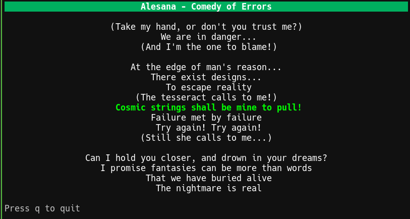

# sprt - Sportify Client TUI

sprt is a command-line interface (CLI) tool for interacting with Spotify. It allows you to authenticate with Spotify, get information about your currently playing track, and display synchronized lyrics for the current track.

## Features

- Authenticate with Spotify using the Authorization Code Flow
- Store authentication tokens securely in a local file
- Get information about your currently playing track
- Display synchronized lyrics for the currently playing track with smooth transitions
- Interactive Terminal User Interface (TUI) for all commands
- Customizable UI with configurable colors and animations
- Smooth animated transitions between different UI screens
- Automatic token refresh when expired

## Installation

### Prerequisites

- Go 1.16 or higher (for building from source)
- A Spotify Developer account
- A registered Spotify application with a client ID and client secret

### Using instl.sh (Recommended)

You can install sprt with a single command:

```bash
curl -sSL instl.sh/muhadif/sprt | bash
```

This will automatically download and install the latest version of sprt for your platform.

### Using Make (Linux and macOS)

1. Clone the repository:

```bash
git clone https://github.com/muhadif/sprt.git
cd sprt
```

2. Install the application:

```bash
make install
```

This will build the application and install it to `/usr/local/bin/sprt`.

### Building from Source

1. Clone the repository:

```bash
git clone https://github.com/muhadif/sprt.git
cd sprt
```

2. Build the application:

```bash
go build -o sprt ./cmd/sprt
```

3. Move the binary to your PATH (optional):

```bash
sudo mv sprt /usr/local/bin/
```

## Usage

### Interactive TUI Menu

The easiest way to use sprt is through its interactive Terminal User Interface (TUI). Simply run:

```bash
sprt
```

This will display a menu where you can select from the available commands using the arrow keys and Enter. When you select a command, the application will smoothly transition to the selected screen with an animated effect, providing a more polished and visually appealing experience.

### Authentication

To initialize the authentication process:

```bash
sprt auth init
```

This will open a TUI prompt for your Spotify client ID and client secret, then display an authorization URL. You can use Ctrl+V (or Cmd+V on Mac) to paste your credentials into the input fields. When the authorization URL is displayed, you can use Ctrl+Y (or Cmd+Y on Mac) to copy it to your clipboard for easy pasting into your browser. Open the authorization URL in your browser to authorize the application. After authorization, you will be redirected to a local callback URL, and the application will exchange the authorization code for an access token.

### Getting Currently Playing Track

To get information about your currently playing track:

```bash
sprt current
```

This will display the title, artist, and album of the currently playing track in a nicely formatted TUI.

### Displaying Synchronized Lyrics

There are two ways to display lyrics:

```bash
# Display lyrics with a nice UI and smooth transitions
sprt lyric show

# Display lyrics in the terminal (pipe mode)
sprt lyric pipe
```

Both commands will fetch lyrics from lrclib.net and display them synchronized with the music. The `show` command uses a TUI with smooth transitions between lines, while the `pipe` command outputs plain text to the terminal. Press q or Ctrl+C to stop the lyrics display.

For more detailed information about the lyrics feature, including configuration options and animation types, see [LYRICS.md](LYRICS.md).

## Developer Guide

### Setting Up Spotify Integration

To integrate your application with Spotify:

1. Create a Spotify Developer account at [developer.spotify.com](https://developer.spotify.com/)
2. Create a new application in the [Spotify Developer Dashboard](https://developer.spotify.com/dashboard/applications)
3. Set the Redirect URI to `http://127.0.0.1:8080/callback`
4. Note your Client ID and Client Secret
5. Use these credentials when running `sprt auth init`

### API Scopes

sprt uses the following Spotify API scopes:
- `user-read-currently-playing`: Required to get information about the currently playing track

### Adding New Features

To add new features to sprt:

1. Define new use cases in the `domain/usecase` package
2. Implement any required repositories in the `infrastructure/persistence` package
3. Add new commands in the `cmd/sprt/cmd` package
4. Update the README.md with documentation for the new features

## Architecture

The application is built using clean architecture principles, with the following layers:

- **Domain**: Contains the core business logic and entities
  - **Entity**: Defines the data structures
  - **Repository**: Defines the interfaces for data access
  - **Usecase**: Implements the business rules

- **Infrastructure**: Contains the implementation details
  - **Persistence**: Implements the repository interfaces
  - **Auth**: Handles authentication with external services

- **Interfaces**: Contains the user interfaces
  - **CLI**: Implements the command-line interface
  - **TUI**: Implements the Terminal User Interface
  - **HTTP**: Implements the HTTP server for callbacks

## Troubleshooting

### Authentication Issues

If you encounter authentication issues:
- Ensure your Client ID and Client Secret are correct
- Check that your Redirect URI is set correctly in the Spotify Developer Dashboard
- Try running `sprt auth init` again to re-authenticate

### No Track Playing

If you get a "No track currently playing" message:
- Make sure you have a track playing on Spotify
- Check that your Spotify account is active and not in offline mode

### Lyrics Not Found

If lyrics are not found for a track:
- The track may not have lyrics available in the lrclib.net database
- Check if the artist and track names are correct

### UI Configuration

If you want to customize the UI appearance:
- Edit the configuration file at `~/.sprt/ui_config.json`
- You can change colors, enable/disable animations, and adjust other display settings
- See [LYRICS.md](LYRICS.md) for detailed configuration options

## Linux Desktop Integration

### GNOME Shell Integration with Executor


sprt writes the current lyric to `/tmp/current-lyric.txt` when you run the `sprt lyric pipe-lyric` command. You can display these lyrics on your GNOME desktop using the [Executor extension](https://extensions.gnome.org/extension/2932/executor/).

To set up:

1. Install the Executor extension from [GNOME Extensions](https://extensions.gnome.org/extension/2932/executor/)
2. Open the Executor settings
3. Add a new command with the following settings:
   - Command: `cat /tmp/current-lyric.txt`
   - Refresh interval: 1 second
   - Display options: Configure as desired (position, font, etc.)

This will display the currently playing lyric on your desktop, synchronized with your music.

## License

This project is licensed under the MIT License - see the LICENSE file for details.

## Acknowledgments

- [Spotify Web API](https://developer.spotify.com/documentation/web-api/)
- [OAuth 2.0 Authorization Code Flow](https://developer.spotify.com/documentation/web-api/tutorials/code-flow)
- [lrclib.net](https://lrclib.net/) for providing synchronized lyrics
